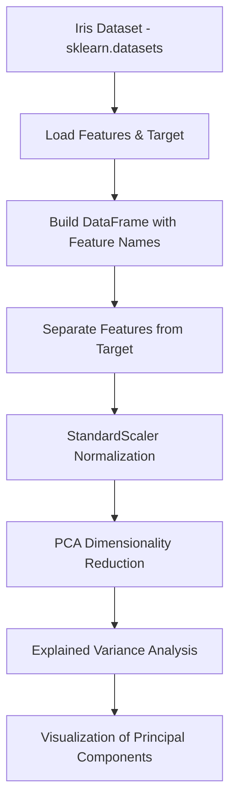

# 🌸 PCA Project on Iris Dataset - Dimensionality Reduction for Species Classification

[](https://www.python.org/)
[](https://scikit-learn.org/)
[](https://pandas.pydata.org/)
[](https://numpy.org/)
[](https://jupyter.org/)
[](LICENSE)

**PCA Project on Iris Dataset** demonstrates Principal Component Analysis (PCA) on the classic Iris dataset — 150 samples of three flower species described by four measurements. The project standardizes the features, reduces dimensionality, and compares two PCA approaches, showing that two principal components capture ~97.77% of the dataset's variance while cleanly separating the species.

---

## ✨ Key Features

### 🎯 1. Data Loading & Feature Engineering
- Loads the Iris dataset via `sklearn.datasets.load_iris` and imports the target labels.
- Concatenates features and target into a single DataFrame and appends the proper feature names.

### ⚡ 2. Preprocessing
- Separates features from the target column.
- Normalizes the DataFrame with `StandardScaler` (mean 0, standard deviation 1) for effective PCA.

### 🔍 3. Principal Component Analysis
- Applies PCA to lower the dimensionality of the feature space.
- Compares two methods: **Method 1** keeps two components (~92.46% + ~5.31% = ~97.77% total variance), while **Method 2** keeps one component (~92.46%).

### 📊 4. Visualization
- Plots the PCA-projected data to observe how well the principal components separate Setosa, Versicolour, and Virginica.
- Reports the explained variance ratio for each principal component.

---

## 🏗️ System Architecture



---

## 🛠️ Technology Stack

### Backend / Core
- **Language**: Python
- **Machine Learning**: Scikit-learn (`load_iris`, `StandardScaler`, `PCA`, `train_test_split`)

### Data & Processing
- **Data Manipulation**: Pandas, NumPy
- **Visualization**: Matplotlib, Seaborn
- **Notebook Environment**: Jupyter Notebook

---

## 🚀 Getting Started

### Prerequisites
- **Python 3.x** with `pip`
- **Jupyter Notebook**

### 1. Repository Setup
```bash
git clone https://github.com/MarwanAbdellah/PCA_Project_on_Iris_Dataset.git
cd PCA_Project_on_Iris_Dataset
```

### 2. Install Dependencies
```bash
pip install numpy pandas scikit-learn matplotlib seaborn jupyter
```

### 3. Run
Open and run the notebook:
```bash
jupyter notebook PCA_Project.ipynb
```

---

## 🧪 Testing & Verification

No automated test suite is included. Verify the results by re-running the notebook end-to-end and confirming the explained-variance output (two components ≈ 97.77%, one component ≈ 92.46%) and that the projected scatter plots visibly separate the three Iris species.

---

## 📁 Project Structure

```text
PCA_Project_on_Iris_Dataset/
├── PCA_Project.ipynb   # PCA implementation & visualization notebook
└── README.md           # Project documentation
```

---

## 👤 Author

**Marwan Abdellah**
- **GitHub**: [@MarwanAbdellah](https://github.com/MarwanAbdellah)
- **LinkedIn**: [Marwan Abdellah](https://www.linkedin.com/in/marwan-abdellah/)

---

## 📄 License

Distributed under the MIT License. See `LICENSE` for more information.
